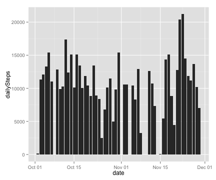
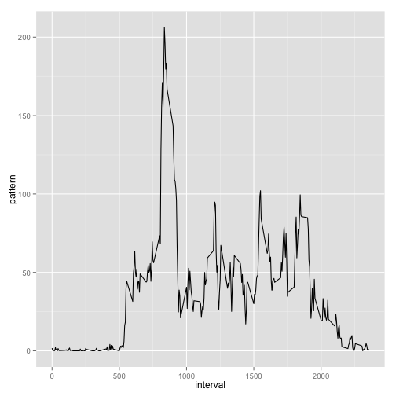
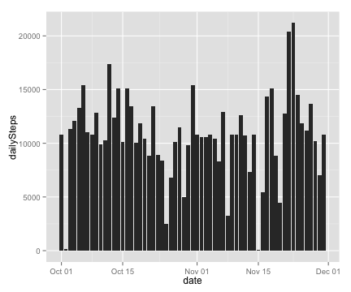
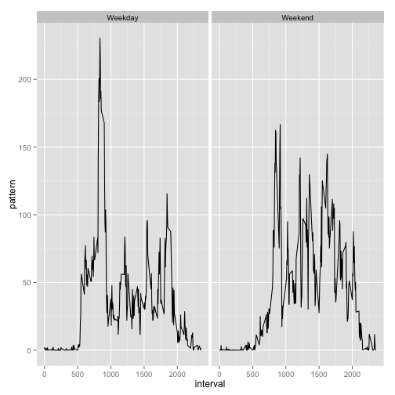

# Reproducible Research: Peer Assessment 1

## Introduction

It is now possible to collect a large amount of data about personal movement using activity monitoring devices such as a [Fitbit](http://www.fitbit.com/home), [Nike Fuelband](http://www.nike.com/us/en_us/c/nikeplus-fuelband), or [Jawbone Up](https://jawbone.com/up). These type of devices are part of the "quantified self" movement - a group of enthusiasts who take measurements about themselves regularly to improve their health, to find patterns in their behavior, or because they are tech geeks. But these data remain under-utilized both because the raw data are hard to obtain and there is a lack of statistical methods and software for processing and interpreting the data.

This assignment makes use of data from a personal activity monitoring device. This device collects data at 5 minute intervals through out the day. The data consists of two months of data from an anonymous individual collected during the months of October and November, 2012 and include the number of steps taken in 5 minute intervals each day.

## Data

The data for this assignment can be downloaded from the course web site:

- Dataset: [Activity monitoring data](https://d396qusza40orc.cloudfront.net/repdata%2Fdata%2Factivity.zip) [52K]

The variables included in this dataset are:

- steps: Number of steps taking in a 5-minute interval (missing values are coded as NA)

- date: The date on which the measurement was taken in YYYY-MM-DD format

- interval: Identifier for the 5-minute interval in which measurement was taken

The dataset is stored in a comma-separated-value (CSV) file and there are a total of 17,568 observations in this dataset.


## Loading and preprocessing the data
Read the data using read.csv() and transform "date" column to DateTime class. Creating data table from csv data.


```r
activityRawData = read.csv("activity.csv")
activityRawData$date = as.Date(activityRawData$date, "%Y-%m-%d")

library(data.table)
activityRawData = data.table(activityRawData)
```


## What is mean total number of steps taken per day?
Removing incomplete cases and then counting mean total number of steps taken per day


```r
activityData = activityRawData[complete.cases(activityRawData), ]
dailyStepsAggData = aggregate(activityData$steps, by = list(Category = activityData$date), 
    FUN = sum)
names(dailyStepsAggData) = c("date", "dailySteps")
```


Make a histogram of the total number of steps taken each day


```r
library(ggplot2, quietly = TRUE)
ggplot(dailyStepsAggData, aes(x = date, y = dailySteps)) + geom_bar(stat = "identity")
```

 


Calculate and report the mean and median total number of steps taken per day


```r
mean(dailyStepsAggData$dailySteps, na.rm = TRUE)
```

```
## [1] 10766
```

```r
median(dailyStepsAggData$dailySteps, na.rm = TRUE)
```

```
## [1] 10765
```


## What is the average daily activity pattern?


```r
dailyActivityAggData = activityData[complete.cases(activityData), list(pattern = mean(steps)), 
    by = interval]
```


Make a time series plot of the 5-minute interval (x-axis) and the average number of steps taken, averaged across all days (y-axis)


```r
ggplot(dailyActivityAggData, aes(x = interval, y = pattern)) + geom_line()
```

 


Get 5-minute interval which contains the maximum number of steps


```r
dailyActivityAggData$interval[which.max(dailyActivityAggData$pattern)]
```

```
## [1] 835
```


## Imputing missing values

Calculate and report the total number of missing values in the dataset


```r
sum(!complete.cases(activityRawData))
```

```
## [1] 2304
```


Steps is the only variable which has missing values in it.I have decided to use mean for the 5 minute interval.
In order to keep the original data intact, I have decided to copy the original data set and then fill the missing
values in copied data set.


```r
fillNAData = copy(activityRawData)
fillNAData = fillNAData[, `:=`(fillNASteps, ifelse(is.na(steps), mean(steps, 
    na.rm = TRUE), steps)), by = interval]
```


Make a histogram of the total number of steps taken each day and Calculate and report the mean and median total number of steps taken per day


```r
naFillTotalSteps = fillNAData[, list(dailySteps = sum(fillNASteps)), by = date]
ggplot(naFillTotalSteps, aes(x = date, y = dailySteps)) + geom_bar(stat = "identity")
```

 

```r
mean(naFillTotalSteps$dailySteps)
```

```
## [1] 10766
```

```r
median(naFillTotalSteps$dailySteps)
```

```
## [1] 10766
```


The mean of daily steps is unchanged,however, the median is different. This is expected as I fill the missing values
with mean activity in each interval.

## Are there differences in activity patterns between weekdays and weekends?

Create a new factor variable in the dataset with two levels ??? ???weekday??? and ???weekend??? indicating whether a given date is a weekday or weekend day


```r
fillNAData[, `:=`(is.weekday, ifelse(weekdays(date) %in% c("Sunday", "Saturday"), 
    "Weekend", "Weekday"))]
```

```
##        steps       date interval fillNASteps is.weekday
##     1:    NA 2012-10-01        0     1.71698    Weekday
##     2:    NA 2012-10-01        5     0.33962    Weekday
##     3:    NA 2012-10-01       10     0.13208    Weekday
##     4:    NA 2012-10-01       15     0.15094    Weekday
##     5:    NA 2012-10-01       20     0.07547    Weekday
##    ---                                                 
## 17564:    NA 2012-11-30     2335     4.69811    Weekday
## 17565:    NA 2012-11-30     2340     3.30189    Weekday
## 17566:    NA 2012-11-30     2345     0.64151    Weekday
## 17567:    NA 2012-11-30     2350     0.22642    Weekday
## 17568:    NA 2012-11-30     2355     1.07547    Weekday
```

```r
fillNAData = fillNAData[, list(pattern = mean(fillNASteps)), by = list(interval, 
    is.weekday)]
```


Make two separate activity pattern plot for weekday and weekend.


```r
ggplot(fillNAData, aes(x = interval, y = pattern)) + geom_line() + facet_wrap(~is.weekday)
```

 

